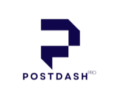

# PostDashPro for AI agents

PostDashPro is social post scheduling for AI agents: queue posts to 12 networks (X, LinkedIn, Instagram, Facebook, TikTok, YouTube, Threads, Pinterest, Bluesky, Telegram, Discord and Mastodon) from the account the person already connected. The hosted MCP server at https://postdashpro.com/api/mcp exposes 24 tools. A future time queues the post as scheduled; anything else lands as a draft. Nothing publishes instantly; a person reviews every item. There is no tool for unsolicited DMs or follower scraping. Auth is OAuth 2.1 with dynamic client registration, or a paste API key. Starter prompts: "What accounts do I have connected?" "Draft three posts for this week and schedule them for 9am." "What is queued for tomorrow?"

This repository ships the skill (`SKILL.md`) and the plugin manifests for
Claude Code, Cursor and Grok Build. The MCP server itself is hosted at
`https://postdashpro.com/api/mcp`.

Networks: X, LinkedIn, Instagram, Facebook, TikTok, YouTube, Threads,
Pinterest, Bluesky, Telegram, Discord and Mastodon.

## Install

There are two ways to authenticate, and the first one asks nothing of you.

**Sign in.** The hosted server speaks OAuth 2.1, so a client that supports it —
the Claude connectors directory, ChatGPT, Claude Code, Cursor, Codex — discovers
that by itself, opens a PostDashPro sign-in page, shows you what the agent will
be able to do, and takes over once you approve. Add the server by URL alone:

```
https://postdashpro.com/api/mcp
```

No key, no header, nothing to paste. The connection appears under Settings, API
& Webhooks, and ending it there disconnects the agent immediately.

**Or use an API key.** Create one under Settings, API & Webhooks. Every command
below carries the same endpoint (`https://postdashpro.com/api/mcp`) and a
placeholder key; leave the header out entirely if you would rather sign in.

**Claude Code — the plugin brings the skill, and one command adds the server:**

```
/plugin marketplace add fortuneflick/postdashpro-claude-plugin
/plugin install postdashpro@postdashpro
```

```bash
claude mcp add --transport http postdashpro https://postdashpro.com/api/mcp \
  --header "Authorization: Bearer YOUR_API_KEY"
```

### Cursor

```text
cursor://anysphere.cursor-deeplink/mcp/install?name=postdashpro&config=eyJ1cmwiOiJodHRwczovL3Bvc3RkYXNocHJvLmNvbS9hcGkvbWNwIiwiaGVhZGVycyI6eyJBdXRob3JpemF0aW9uIjoiQmVhcmVyIFlPVVJfQVBJX0tFWSJ9fQ==
```

Open this link and Cursor offers to add the server. Replace the placeholder key
in Settings, MCP afterwards, or paste the same object into `.cursor/mcp.json`.

### Codex CLI

```bash
codex mcp add postdashpro --url https://postdashpro.com/api/mcp \
  --bearer-token-env-var POSTDASHPRO_API_KEY
```

The token stays in your environment; Codex writes only the variable name to
`~/.codex/config.toml`.

### Gemini CLI

```bash
gemini mcp add --transport http \
  --header "Authorization: Bearer YOUR_API_KEY" \
  postdashpro https://postdashpro.com/api/mcp
```

### VS Code

```bash
code --add-mcp '{"name":"postdashpro","type":"http","url":"https://postdashpro.com/api/mcp","headers":{"Authorization":"Bearer YOUR_API_KEY"}}'
```

### Windsurf

```json
{
  "mcpServers": {
    "postdashpro": {
      "serverUrl": "https://postdashpro.com/api/mcp",
      "headers": {
        "Authorization": "Bearer YOUR_API_KEY"
      }
    }
  }
}
```

Goes in `~/.codeium/windsurf/mcp_config.json`, then refresh the MCP panel.

### OpenCode

```json
{
  "mcp": {
    "postdashpro": {
      "type": "remote",
      "url": "https://postdashpro.com/api/mcp",
      "enabled": true,
      "headers": {
        "Authorization": "Bearer {env:POSTDASHPRO_API_KEY}"
      }
    }
  }
}
```

Goes in `opencode.json`; the key is read from your environment rather than
written to the file.

### A client with no field for a bearer token

Connector interfaces that offer only "OAuth" or "no authentication" should now
pick **OAuth** and sign in — that is what the flow above is for. The older
workaround still works for anything that supports neither, with the key as a
path segment:

```
https://postdashpro.com/api/mcp/k/YOUR_API_KEY
```

Choose "no authentication". A URL is leakier than a header — it reaches browser
history, screenshots and the logs of anything in between — so prefer the header
form wherever the client allows it. The key is scoped to one account and
revocable from Settings.

**Grok Build:** run `/marketplace` and pick PostDashPro, or add this repository
as a marketplace source. The Grok manifest (`.grok-plugin/plugin.json`) is the
only one that bundles the hosted server through its `mcpServers` field, so Grok
gets the tools and the skill in one install. The Claude Code and Cursor plugins
are skill-only on purpose: installing one never registers a second PostDashPro
server beside a connector you already have.

**Any agent (skill only):**

```bash
npx skills add fortuneflick/postdashpro-claude-plugin
```

## What the agent can do

- List the connected accounts and which one is active on each network.
- Schedule a post to one network, several, or every connected one, with up to
  10 photos or videos attached.
- Find an existing image in the library, import one from a public URL, or
  hand the user a short-lived upload link and wait for the file to land.
- Read the current time in the account's own timezone before scheduling
  anything relative.
- Read the saved Brand Voice profile, and add or list Idea Board cards.

## What the agent cannot do

- **It cannot publish immediately.** A future time queues the post; anything
  else is a draft. The review step is not optional and no tool skips it.
- **It cannot connect or disconnect a social account.** That is a person's job.
- **It cannot send a file it was given in chat.** An attached image is pixels,
  not bytes. It asks for a URL.
- **It cannot raise a plan limit** or change which clients the plan allows.

## Security

- **No executable code in the install path.** The skill is Markdown and the
  manifests are JSON. Nothing here runs, downloads a binary, or installs
  anything beyond copying those files into your agent.
- **One runtime endpoint:** `https://postdashpro.com/api/mcp` over HTTPS. Every
  connect command above names that address; the tools run there.
- **Credentials:** either an OAuth sign-in or a bearer API key created under
  Settings, API & Webhooks. This repository contains no keys and never asks for
  one in chat. The Claude plugin's server entry carries no key: Claude Code,
  claude.ai and Cowork sign you in through OAuth the first time a tool runs.
- **OAuth:** authorization code with PKCE. The consent screen lists what the
  agent will be able to do before you approve it. Access tokens last a day and
  refresh tokens rotate each time they are used, so a copied one stops working.
  Nothing issued is stored in readable form.
- **Scope:** a key reaches one account's posts, media and connections. It
  cannot read another account, and it is revocable from Settings.
- **No telemetry.** Nothing here phones home.

## Links

- Guide: https://postdashpro.com/guide
- Pricing: https://postdashpro.com/#pricing
- Privacy: https://postdashpro.com/privacy-policy
- Terms: https://postdashpro.com/terms-of-service
- Support: hello@postdashpro.com

## License

MIT — see [LICENSE](LICENSE).
