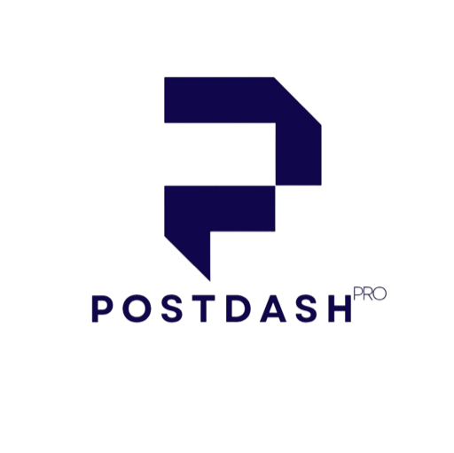

<p align="center"></p>

# PostDashPro for AI agents

**Social scheduling built for agents that post on someone else's behalf.** Your
agent picks or generates the image, writes the caption, and queues the post to
any of 12 networks in the account's own timezone. Nothing publishes instantly:
a future time queues the post as scheduled, anything else lands as a draft, and
a person reviews it either way.

This repository ships the skill (`SKILL.md`) and the plugin manifests for
Claude Code, Cursor and Grok Build. The MCP server itself is hosted at
`https://postdashpro.com/api/mcp`.

Networks: X, LinkedIn, Instagram, Facebook, TikTok, YouTube, Threads,
Pinterest, Bluesky, Telegram, Discord and Mastodon.

## Install

Create an API key first: PostDashPro, then Settings, then Integrations. Every
line below carries the same endpoint (`https://postdashpro.com/api/mcp`) and a
placeholder key.

**Claude Code — the plugin brings the skill, and one command adds the server:**

```
/plugin marketplace add fortuneflick/postdashpro-claude-plugin
/plugin install postdashpro@postdashpro
```

```bash
claude mcp add --transport http postdashpro https://postdashpro.com/api/mcp \
  --header "Authorization: Bearer YOUR_API_KEY"
```

### Cursor

```text
cursor://anysphere.cursor-deeplink/mcp/install?name=postdashpro&config=eyJ1cmwiOiJodHRwczovL3Bvc3RkYXNocHJvLmNvbS9hcGkvbWNwIiwiaGVhZGVycyI6eyJBdXRob3JpemF0aW9uIjoiQmVhcmVyIFlPVVJfQVBJX0tFWSJ9fQ==
```

Open this link and Cursor offers to add the server. Replace the placeholder key
in Settings, MCP afterwards, or paste the same object into `.cursor/mcp.json`.

### Codex CLI

```bash
codex mcp add postdashpro --url https://postdashpro.com/api/mcp \
  --bearer-token-env-var POSTDASHPRO_API_KEY
```

The token stays in your environment; Codex writes only the variable name to
`~/.codex/config.toml`.

### Gemini CLI

```bash
gemini mcp add --transport http \
  --header "Authorization: Bearer YOUR_API_KEY" \
  postdashpro https://postdashpro.com/api/mcp
```

### VS Code

```bash
code --add-mcp '{"name":"postdashpro","type":"http","url":"https://postdashpro.com/api/mcp","headers":{"Authorization":"Bearer YOUR_API_KEY"}}'
```

### Windsurf

```json
{
  "mcpServers": {
    "postdashpro": {
      "serverUrl": "https://postdashpro.com/api/mcp",
      "headers": {
        "Authorization": "Bearer YOUR_API_KEY"
      }
    }
  }
}
```

Goes in `~/.codeium/windsurf/mcp_config.json`, then refresh the MCP panel.

### OpenCode

```json
{
  "mcp": {
    "postdashpro": {
      "type": "remote",
      "url": "https://postdashpro.com/api/mcp",
      "enabled": true,
      "headers": {
        "Authorization": "Bearer {env:POSTDASHPRO_API_KEY}"
      }
    }
  }
}
```

Goes in `opencode.json`; the key is read from your environment rather than
written to the file.

### A client with no field for a bearer token

Some connector interfaces offer only OAuth or no authentication, with nowhere
to put a header. For those, the key goes in the path instead:

```
https://postdashpro.com/api/mcp/k/YOUR_API_KEY
```

Choose "no authentication". A URL is leakier than a header — it reaches browser
history, screenshots and the logs of anything in between — so prefer the header
form wherever the client allows it. The key is scoped to one account and
revocable from Settings.

**Grok Build:** run `/marketplace` and pick PostDashPro, or add this repository
as a marketplace source. The Grok manifest (`.grok-plugin/plugin.json`) is the
only one that bundles the hosted server through its `mcpServers` field, so Grok
gets the tools and the skill in one install. The Claude Code and Cursor plugins
are skill-only on purpose: installing one never registers a second PostDashPro
server beside a connector you already have.

**Any agent (skill only):**

```bash
npx skills add fortuneflick/postdashpro-claude-plugin
```

## What the agent can do

- List the connected accounts and which one is active on each network.
- Schedule a post to one network, several, or every connected one, with up to
  10 photos or videos attached.
- Find an existing image in the library, generate one with the account's own
  connected AI, import one from a public URL, or hand the user a short-lived
  upload link and wait for the file to land.
- Read the current time in the account's own timezone before scheduling
  anything relative.
- Read the saved Brand Voice profile, and add or list Idea Board cards.

## What the agent cannot do

- **It cannot publish immediately.** A future time queues the post; anything
  else is a draft. The review step is not optional and no tool skips it.
- **It cannot connect or disconnect a social account.** That is a person's job.
- **It cannot send a file it was given in chat.** An attached image is pixels,
  not bytes. It generates one or asks for a URL.
- **It cannot raise a plan limit** or change which clients the plan allows.

## Security

- **No executable code in the install path.** The skill is Markdown and the
  manifests are JSON. Nothing here runs, downloads a binary, or installs
  anything beyond copying those files into your agent.
- **One runtime endpoint:** `https://postdashpro.com/api/mcp` over HTTPS. Every
  connect command above names that address; the tools run there.
- **Credentials:** a bearer API key created under Settings, Integrations. This
  repository contains no keys and never asks for one in chat. The Claude Code
  manifest reads `POSTDASHPRO_API_KEY` from your environment rather than
  writing it to a config file.
- **Scope:** a key reaches one account's posts, media and connections. It
  cannot read another account, and it is revocable from Settings.
- **No telemetry.** Nothing here phones home.

## Links

- Guide: https://postdashpro.com/guide
- Pricing: https://postdashpro.com/#pricing
- Privacy: https://postdashpro.com/privacy-policy
- Terms: https://postdashpro.com/terms-of-service
- Support: hello@postdashpro.com

## License

MIT — see [LICENSE](LICENSE).
